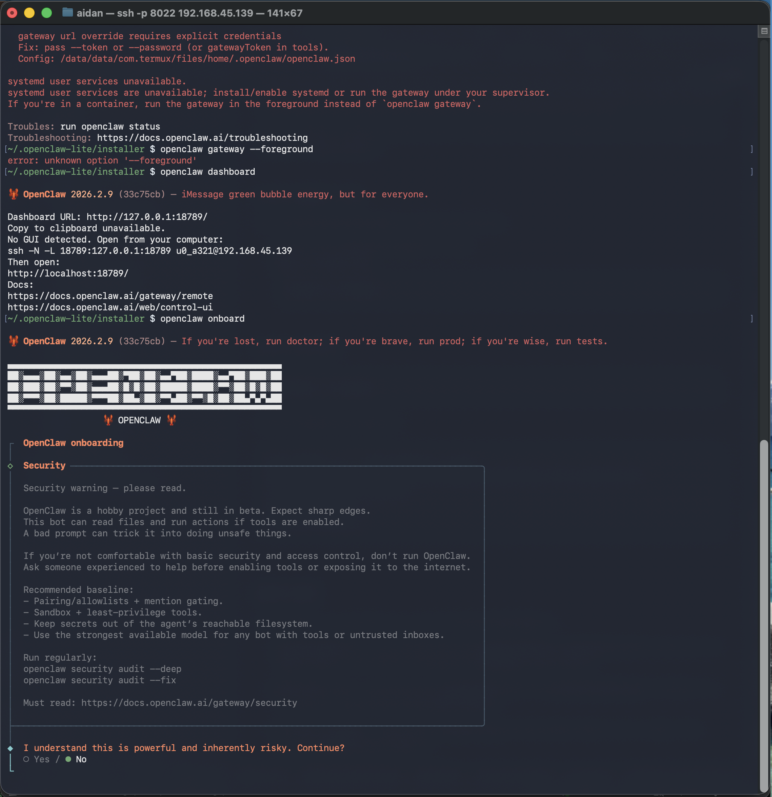

# OpenClaw on Android

[English](README.md) | [한국어](README.ko.md) | [中文](README.zh.md)


Androidにもシェルを。

## Linuxのインストール不要

AndroidでOpenClawを実行する一般的な方法では、proot-distroでLinuxをインストールする必要があり、700MB〜1GBのオーバーヘッドが発生します。OpenClaw on Androidは、glibcの動的リンカー（ld.so）だけをインストールすることでこの手間を解消し、完全なLinuxディストリビューションなしでOpenClawを実行できるようにします。

**従来の方式**: Termux上でproot-distroを使い、完全なLinuxディストリビューションをインストールする方式です。

```
┌───────────────────────────────────────────────────┐
│ Linux Kernel                                      │
│ ┌───────────────────────────────────────────────┐ │
│ │ Android · Bionic libc · Termux                │ │
│ │ ┌───────────────────────────────────────────┐ │ │
│ │ │ proot-distro · Debian/Ubuntu              │ │ │
│ │ │ ┌───────────────────────────────────────┐ │ │ │
│ │ │ │ GNU glibc                             │ │ │ │
│ │ │ │ Node.js → OpenClaw                    │ │ │ │
│ │ │ └───────────────────────────────────────┘ │ │ │
│ │ └───────────────────────────────────────────┘ │ │
│ └───────────────────────────────────────────────┘ │
└───────────────────────────────────────────────────┘
```

**本プロジェクト**: proot-distroを使わず、glibc動的リンカーのみを利用します。

```
┌───────────────────────────────────────────────────┐
│ Linux Kernel                                      │
│ ┌───────────────────────────────────────────────┐ │
│ │ Android · Bionic libc · Termux                │ │
│ │ ┌───────────────────────────────────────────┐ │ │
│ │ │ glibc ld.so (linker only)                 │ │ │
│ │ │ ld.so → Node.js → OpenClaw                │ │ │
│ │ └───────────────────────────────────────────┘ │ │
│ └───────────────────────────────────────────────┘ │
└───────────────────────────────────────────────────┘
```

| | 従来方式 (proot-distro) | 本プロジェクト |
|---|---|---|
| ストレージ消費 | 1〜2GB（Linux + パッケージ） | 約200MB |
| セットアップ時間 | 20〜30分 | 3〜10分 |
| パフォーマンス | 遅い（prootレイヤー経由） | ネイティブ速度 |
| 手順 | ディストリビューションのインストール、Linuxの設定、Node.jsのインストール、パスの修正… | コマンド1つ |

##  Claw アプリ

スタンドアロンのAndroidアプリも提供されています。ターミナルエミュレータとWebViewベースのUIを単一のAPKにバンドルしており、Termuxは不要です。

- ワンタップセットアップ: bootstrap、Node.js、OpenClawをアプリ内からまとめてインストール
- ゲートウェイ制御、ランタイム情報、ツール管理を行うダッシュボードを内蔵
- Termuxとは独立して動作 — アプリをインストールしても既存のTermux + `oa` 環境には影響しません

APKは[Releases](https://github.com/AidanPark/openclaw-android/releases)ページからダウンロードできます。

## 動作要件

- Android 7.0以上（Android 10以降推奨）
- 約1GBの空きストレージ
- Wi-Fiまたはモバイルデータ通信

## 何をしてくれるのか

インストーラーがTermuxと標準Linuxの差異を自動的に解決します。手動で行う作業は一切なく、以下の処理がすべて1つのコマンドで完結します。

1. **glibc環境の構築** — pacmanのglibc-runner経由でglibc動的リンカーを導入し、標準的なLinuxバイナリを変更なしに動作させます
2. **Node.js (glibc版)** — 公式のNode.js linux-arm64をダウンロードし、ld.soローダースクリプトでラップします（Androidでセグフォルトを起こすpatchelfは使いません）
3. **パス変換** — 標準的なLinuxパス（`/tmp`、`/bin/sh`、`/usr/bin/env`）をTermuxのパスに自動変換します
4. **一時ディレクトリの設定** — Androidからアクセス可能な一時フォルダを設定します
5. **サービスマネージャの回避** — systemdなしで通常動作するよう設定します
6. **OpenCode統合** — 選択された場合、Bunスタンドアロンバイナリ向けにproot + ld.soの連結方式でOpenCodeをインストールします

## ステップバイステップのセットアップ（新品の端末から）

1. [スマートフォンの準備](#ステップ-1-スマートフォンの準備)
2. [Termuxのインストール](#ステップ-2-termuxのインストール)
3. [Termuxの初期セットアップ](#ステップ-3-termuxの初期セットアップ)
4. [OpenClawのインストール](#ステップ-4-openclawのインストール) — コマンド1つ
5. [OpenClawのセットアップ開始](#ステップ-5-openclawのセットアップ開始)
6. [OpenClaw（ゲートウェイ）の起動](#ステップ-6-openclawゲートウェイの起動)

### ステップ 1: スマートフォンの準備

開発者オプション、スリープ無効化、充電上限、バッテリー最適化の設定を行います。詳しい手順は[プロセスを生かし続けるためのガイド](docs/disable-phantom-process-killer.md)を参照してください。

### ステップ 2: Termuxのインストール

> **重要**: Play Store版のTermuxはサポートが終了しており動作しません。必ずF-Droidからインストールしてください。

1. スマートフォンのブラウザで[f-droid.org](https://f-droid.org)を開きます
2. `Termux`を検索し、**Download APK**をタップしてダウンロード・インストールします
   - 「提供元不明のアプリのインストール」を許可するよう求められた場合は許可してください

### ステップ 3: Termuxの初期セットアップ

Termuxアプリを開き、次のコマンドを貼り付けてcurlをインストールします（次のステップで必要になります）。

```bash
pkg update -y && pkg install -y curl
```

> 初回起動時にミラーの選択を求められることがあります。どれでも構いませんが、地理的に近いミラーの方が高速です。

### ステップ 4: OpenClawのインストール

> **ヒント: SSHを使うと入力が楽になります**
> このステップ以降は、スマートフォンの画面ではなくPCのキーボードからコマンドを入力できます。詳細は[Termux SSHセットアップガイド](docs/termux-ssh-guide.md)を参照してください。

Termuxで以下のコマンドを貼り付けてください。

```bash
curl -sL myopenclawhub.com/install | bash && source ~/.bashrc
```

すべて1つのコマンドで自動的にインストールされます。所要時間はネットワーク速度や端末によって3〜10分です。Wi-Fi環境を推奨します。

完了するとOpenClawのバージョンが表示され、`openclaw onboard`の実行案内が出ます。

### ステップ 5: OpenClawのセットアップ開始

インストール出力の指示に従って、次を実行します。

```bash
openclaw onboard
```

画面の指示に従って初期セットアップを完了させます。



### ステップ 6: OpenClaw（ゲートウェイ）の起動

セットアップが完了したらゲートウェイを起動します。

> **重要**: `openclaw gateway`はSSH経由ではなく、スマートフォン上のTermuxアプリで直接実行してください。SSH経由で実行するとSSH接続が切れた時点でゲートウェイも停止してしまいます。

ゲートウェイは実行中ターミナルを占有するため、専用のタブで起動します。下部メニューバーの**ハンバーガーアイコン (☰)** をタップするか、画面左端（下部メニューバーより上）から右にスワイプしてサイドメニューを開き、**NEW SESSION**をタップします。


新しいタブで以下を実行します。

```bash
openclaw gateway
```


> ゲートウェイを停止するには `Ctrl+C` を使ってください。`Ctrl+Z` ではプロセスが終了せずサスペンドされるだけなので使わないでください。

## プロセスを生かし続ける

Androidは画面オフ時にバックグラウンドプロセスを終了したりスロットルしたりすることがあります。推奨される設定（開発者オプション、スリープ無効化、充電上限、バッテリー最適化、Phantom Process Killer）の詳細は[プロセスを生かし続けるためのガイド](docs/disable-phantom-process-killer.md)を参照してください。

## PCからダッシュボードにアクセス

SSHアクセスとダッシュボードトンネルの設定方法は[Termux SSHセットアップガイド](docs/termux-ssh-guide.md)を参照してください。

## 複数端末の管理

同じネットワーク上の複数端末でOpenClawを運用する場合は、<a href="https://myopenclawhub.com" target="_blank">Dashboard Connect</a> ツールを使うとPCからまとめて管理できます。

- 各端末ごとに接続設定（IP、トークン、ポート）をニックネーム付きで保存
- SSHトンネルコマンドとダッシュボードURLを自動生成
- **データはローカルに留まります** — 接続設定（IP、トークン、ポート）はブラウザのlocalStorageにのみ保存され、サーバーに送信されることはありません。

## CLIリファレンス

インストール後、`oa`コマンドでインストールを管理できます。

| オプション | 説明 |
|--------|-------------|
| `oa --update` | OpenClawとAndroid向けパッチを更新 |
| `oa --install` | オプションツール（tmux、code-server、AI CLIなど）をインストール |
| `oa --uninstall` | OpenClaw on Androidをアンインストール |
| `oa --backup` | OpenClawデータの完全バックアップを作成 |
| `oa --restore` | バックアップから復元 |
| `oa --status` | インストール状況とインストール済みコンポーネントを表示 |
| `oa --version` | バージョンを表示 |
| `oa --help` | 利用可能なオプションを表示 |

## アップデート

```bash
oa --update && source ~/.bashrc
```

このコマンド1つで、インストール済みコンポーネントをすべて一括で更新します。

- **OpenClaw** — コアパッケージ（`openclaw@latest`）
- **code-server** — ブラウザIDE
- **OpenCode** — AIコーディングアシスタント
- **AI CLIツール** — Claude Code、Gemini CLI、Codex CLI（Termux）
- **Androidパッチ** — 本プロジェクトの互換性パッチ

最新の状態のコンポーネントはスキップされます。インストールされていないコンポーネントには触れないため、すでに端末上にあるものだけが更新対象になります。何度実行しても安全です。

> `oa`コマンドが利用できない場合（古いインストール環境）は、curl経由で実行してください。
> ```bash
> curl -sL myopenclawhub.com/update | bash && source ~/.bashrc
> ```

## バックアップとリストア

OpenClaw標準のバックアップコマンド（`openclaw backup create`）はハードリンクに依存しており、Androidのアプリ専用ストレージではブロックされるため、しばしば失敗します。`oa --backup`コマンドは、OpenClawのバックアップ仕様との完全な互換性を保ちつつ`tar`を直接利用することでこの問題を回避します。

バックアップを作成するには:
```bash
oa --backup
```
バックアップは `~/.openclaw-android/backup/` にタイムスタンプ付きのファイル名（例: `2026-03-14T00-00-00.000Z-openclaw-backup.tar.gz`）で保存されます。`oa --backup ~/my-backups/` のように保存先を指定することもできます。各バックアップには設定、状態、ワークスペース、エージェントが含まれます。

バックアップから復元するには:
```bash
oa --restore
```
このコマンドはデフォルトのバックアップディレクトリから利用可能なバックアップを一覧表示します。復元したいバックアップの番号を選ぶだけで、バックアップマニフェストからプラットフォームを自動検出し、`~/.openclaw/`への復元処理を行います。既存データを上書きするため、確認プロンプトが表示されます。

## トラブルシューティング

詳しい解決方法は[トラブルシューティングガイド](docs/troubleshooting.md)を参照してください。

## パフォーマンス

`openclaw status` などのCLIコマンドはPC上での動作よりも遅く感じられることがあります。これはコマンド実行のたびに多数のファイルを読み込む必要があり、スマートフォンのストレージはPCより遅く、Androidのセキュリティ処理によるオーバーヘッドも加わるためです。

ただし、**ゲートウェイが起動した後はその差はなくなります**。プロセスはメモリ上に常駐するためファイル再読み込みは不要で、AIの応答処理は外部サーバーで行われるため、PCと同じ速度で動作します。

## Android上でのローカルLLM

OpenClawは [node-llama-cpp](https://github.com/withcatai/node-llama-cpp) によるローカルLLM推論をサポートしています。ビルド済みネイティブバイナリ（`@node-llama-cpp/linux-arm64`）はインストールに同梱されており、glibc環境で正常にロードされます — つまり**スマートフォン上でローカルLLMは技術的には動作します**。

ただし、現実的には以下の制約があります。

| 制約 | 詳細 |
|------|------|
| RAM | GGUFモデルは少なくとも2〜4GBの空きメモリが必要（7Bモデル、Q4量子化）。スマートフォンのRAMはAndroidや他のアプリと共有 |
| ストレージ | モデルファイルは4GBから70GB以上に及ぶ。端末のストレージはすぐ埋まる |
| 速度 | ARM上のCPUのみによる推論は非常に遅い。AndroidではllamaのGPUオフロードがサポートされていない |
| 用途 | OpenClawは主にクラウドLLM API（OpenAI、Geminiなど）にルーティングし、PCと同じ速度で応答します。ローカル推論はあくまで補助的な機能 |

実験用途であればTinyLlama 1.1B（Q4、約670MB）のような小型モデルなら端末上で動作します。実用にはクラウドLLMプロバイダの利用を推奨します。

> **なぜ `--ignore-scripts` ?** インストーラーは `npm install -g openclaw@latest --ignore-scripts` を使います。これは、node-llama-cppのpostinstallスクリプトがcmake経由でllama.cppをソースからコンパイルしようとし、スマートフォンでは30分以上かかるうえツールチェインの非互換で失敗するためです。ビルド済みバイナリはこのコンパイルなしで動作するため、postinstallは安全にスキップできます。

<details>
<summary>開発者向けの技術ドキュメント</summary>

## インストールされるコンポーネント

インストーラーは複数のパッケージマネージャを横断してインフラ、プラットフォームパッケージ、オプションツールをセットアップします。コアインフラとプラットフォーム依存関係は自動でインストールされ、オプションツールはインストール時に個別にプロンプトされます。

### コアインフラ

| コンポーネント | 役割 | インストール方法 |
|-----------|------|----------------|
| git | バージョン管理、npm gitディペンデンシ | `pkg install` |

### エージェントプラットフォームのランタイム依存

これらはプラットフォームの `config.env` フラグで制御されます。OpenClawではすべてインストールされます。

| コンポーネント | 役割 | インストール方法 |
|-----------|------|----------------|
| [pacman](https://wiki.archlinux.org/title/Pacman) | glibcパッケージのパッケージマネージャ | `pkg install` |
| [glibc-runner](https://github.com/termux-pacman/glibc-packages) | glibc動的リンカー — Android上で標準Linuxバイナリを実行可能に | `pacman -Sy` |
| [Node.js](https://nodejs.org/) v22 LTS (linux-arm64) | OpenClaw用JavaScriptランタイム | nodejs.orgから直接ダウンロード |
| python | ネイティブC/C++アドオンのビルドスクリプト（node-gyp） | `pkg install` |
| make | ネイティブモジュール用Makefile実行 | `pkg install` |
| cmake | CMakeベースのネイティブモジュールビルド | `pkg install` |
| clang | ネイティブモジュール用C/C++コンパイラ | `pkg install` |
| binutils | ネイティブビルド向けバイナリユーティリティ（llvm-ar） | `pkg install` |

### OpenClawプラットフォーム

| コンポーネント | 役割 | インストール方法 |
|-----------|------|----------------|
| [OpenClaw](https://github.com/openclaw/openclaw) | AIエージェントプラットフォーム（コア） | `npm install -g` |
| [clawdhub](https://github.com/AidanPark/clawdhub) | OpenClaw向けスキルマネージャ | `npm install -g` |
| [PyYAML](https://pyyaml.org/) | `.skill` パッケージング用YAMLパーサー | `pip install` |
| libvips | sharpビルド用の画像処理ヘッダ | `pkg install`（更新時） |

### オプションツール（インストール時にプロンプト）

各ツールは個別のY/nプロンプトで提示されます。インストール対象は自由に選択できます。

| コンポーネント | 役割 | インストール方法 |
|-----------|------|----------------|
| [tmux](https://github.com/tmux/tmux) | バックグラウンドセッション用ターミナルマルチプレクサ | `pkg install` |
| [ttyd](https://github.com/tsl0922/ttyd) | Webターミナル — ブラウザからTermuxへアクセス | `pkg install` |
| [dufs](https://github.com/sigoden/dufs) | ブラウザベースのファイル転送向けHTTP/WebDAVファイルサーバ | `pkg install` |
| [android-tools](https://developer.android.com/tools/adb) | Phantom Process Killer無効化用のADB | `pkg install` |
| [code-server](https://github.com/coder/code-server) | ブラウザベースのVS Code IDE | GitHubから直接ダウンロード |
| [OpenCode](https://opencode.ai/) | AIコーディングアシスタント（TUI）。依存として [Bun](https://bun.sh/) と [proot](https://proot-me.github.io/) を自動インストール | `bun install -g` |
| [Chromium](https://www.chromium.org/) | OpenClaw向けブラウザ自動化（約400MB） | カスタムインストールスクリプト |
| [Playwright](https://playwright.dev/) | ブラウザ自動化ライブラリ（Chromium必須）。`PLAYWRIGHT_CHROMIUM_EXECUTABLE_PATH` を自動設定 | カスタムインストールスクリプト |
| [Claude Code](https://github.com/anthropics/claude-code) (Anthropic) | AI CLIツール | `npm install -g` |
| [Gemini CLI](https://github.com/google-gemini/gemini-cli) (Google) | AI CLIツール | `npm install -g` |
| [Codex CLI](https://github.com/DioNanos/codex-termux) (OpenAI CodexのTermuxフォーク) | AI CLIツール | `npm install -g` |

## プロジェクト構成

```
openclaw-android/
├── bootstrap.sh                # curl | bash ワンライナーインストーラー（ダウンローダー）
├── install.sh                  # プラットフォーム対応インストーラー（エントリポイント）
├── oa.sh                       # 統合CLI（$PREFIX/bin/oa としてインストール）
├── post-setup.sh               # Claw アプリのpost-bootstrapセットアップ（OTA配信）
├── update.sh                   # 軽量ラッパー（update-core.sh をダウンロード・実行）
├── update-core.sh              # 既存インストール向けの軽量アップデーター
├── uninstall.sh                # クリーン削除（オーケストレーター）
├── patches/
│   ├── glibc-compat.js         # Node.jsランタイムパッチ（os.cpus、networkInterfaces）
│   ├── argon2-stub.js          # argon2ネイティブモジュール用JSスタブ（code-server）
│   ├── termux-compat.h         # Bionicネイティブビルド用Cヘッダ（sharp）
│   ├── spawn.h                 # POSIX spawnスタブヘッダ
│   ├── systemctl               # Termux用systemdスタブ
│   ├── apply-patches.sh        # レガシーパッチオーケストレーター（v1.0.2互換）
│   └── patch-paths.sh          # レガシーパス修正（v1.0.2互換）
├── scripts/
│   ├── lib.sh                  # 共有関数ライブラリ（色、プラットフォーム検出、プロンプト）
│   ├── check-env.sh            # 起動前環境チェック
│   ├── install-infra-deps.sh   # コアインフラパッケージ（L1）
│   ├── install-glibc.sh        # glibc-runnerインストール（L2 条件付き）
│   ├── install-nodejs.sh       # Node.js glibcラッパーのインストール（L2 条件付き）
│   ├── install-build-tools.sh  # ネイティブモジュール用ビルドツール（L2 条件付き）
│   ├── backup.sh               # OpenClawデータのバックアップ・復元（oa --backup/--restore）
│   ├── build-sharp.sh          # sharpネイティブモジュール（画像処理）のビルド
│   ├── install-chromium.sh     # ブラウザ自動化用Chromiumのインストール
│   ├── install-playwright.sh   # Playwrightブラウザ自動化ライブラリのインストール
│   ├── install-code-server.sh  # code-server（ブラウザIDE）のインストール・更新
│   ├── install-opencode.sh     # OpenCodeのインストール
│   ├── setup-env.sh            # 環境変数設定
│   └── setup-paths.sh          # ディレクトリ作成とシンボリックリンク
├── platforms/
│   ├── openclaw/               # OpenClawプラットフォームプラグイン
│   │   ├── config.env          # プラットフォームメタデータと依存宣言
│   │   ├── env.sh              # プラットフォーム固有の環境変数
│   │   ├── install.sh          # プラットフォームパッケージのインストール（npm、パッチ、clawdhub）
│   │   ├── update.sh           # プラットフォームパッケージの更新
│   │   ├── uninstall.sh        # プラットフォームパッケージの削除
│   │   ├── status.sh           # プラットフォーム状態表示
│   │   ├── verify.sh           # プラットフォーム検証チェック
│   │   └── patches/            # プラットフォーム固有のパッチ
│   │       ├── openclaw-apply-patches.sh
│   │       ├── openclaw-patch-paths.sh
│   │       └── openclaw-build-sharp.sh
├── tests/
│   └── verify-install.sh       # インストール後検証（オーケストレーター + プラットフォーム）
└── docs/
    ├── disable-phantom-process-killer.md    # プロセスを生かし続けるためのガイド (EN)
    ├── disable-phantom-process-killer.ko.md # プロセスを生かし続けるためのガイド (KO)
    ├── termux-ssh-guide.md     # Termux SSHセットアップガイド (EN)
    ├── termux-ssh-guide.ko.md  # Termux SSHセットアップガイド (KO)
    ├── troubleshooting.md      # トラブルシューティングガイド (EN)
    ├── troubleshooting.ko.md   # トラブルシューティングガイド (KO)
    └── images/                 # スクリーンショットと画像
```

## アーキテクチャ

本プロジェクトは、プラットフォームに依存しないインフラとプラットフォーム固有コードを分離する**プラットフォームプラグイン構成**を採用しています。

```
┌─────────────────────────────────────────────────────────────┐
│  オーケストレーター (install.sh, update-core.sh, uninstall.sh) │
│  ── プラットフォーム非依存。config.env を読みデリゲート          │
├─────────────────────────────────────────────────────────────┤
│  共有スクリプト (scripts/)                                     │
│  ── L1: install-infra-deps.sh（常時）                         │
│  ── L2: install-glibc.sh, install-nodejs.sh,                 │
│         install-build-tools.sh（config.env 条件付き）          │
│  ── L3: オプションツール（ユーザー選択）                         │
├─────────────────────────────────────────────────────────────┤
│  プラットフォームプラグイン (platforms/<name>/)                 │
│  ── config.env: 依存宣言（PLATFORM_NEEDS_*）                  │
│  ── install.sh / update.sh / uninstall.sh / ...              │
└─────────────────────────────────────────────────────────────┘
```

**依存関係のレイヤー:**

| レイヤー | スコープ | 例 | 制御元 |
|-------|-------|----------|---------------|
| L1 | インフラ（常時インストール） | git、`pkg update` | オーケストレーター |
| L2 | プラットフォームランタイム（条件付き） | glibc、Node.js、ビルドツール | `config.env` フラグ |
| L3 | オプションツール（ユーザー選択） | tmux、code-server、AI CLI | ユーザープロンプト |

各プラットフォームは `config.env` でL2依存を宣言します。

```bash
# platforms/openclaw/config.env
PLATFORM_NEEDS_GLIBC=true
PLATFORM_NEEDS_NODEJS=true
PLATFORM_NEEDS_BUILD_TOOLS=true
```

オーケストレーターはこれらのフラグを読み、対応するインストールスクリプトを条件付きで実行します。特定の依存を必要としないプラットフォームでは該当フラグを `false` に設定するだけで、重い依存をまるごとスキップできます。

## 詳細なインストールフロー

`bash install.sh` を実行すると、次の8ステップが順に実行されます。

### [1/8] 環境チェック — `scripts/check-env.sh`

インストール開始前に現在の環境が適切かを検証します。

- **Termux検出**: `$PREFIX` 環境変数を確認。Termux外では即終了
- **アーキテクチャチェック**: `uname -m` でCPUアーキテクチャを確認（aarch64推奨、armv7lサポート、x86_64はエミュレータ扱い）
- **ディスク容量**: `$PREFIX` パーティションに最低1000MBの空きを要求。不足時はエラー
- **既存インストール**: `openclaw` コマンドが既にあれば現バージョンを表示し、再インストール／アップグレードである旨を案内
- **Node.js事前チェック**: 既にNode.jsが入っていればバージョンを表示し、22未満の場合は警告
- **Phantom Process Killer**（Android 12+）: Phantom Process Killerに関する案内を [無効化ガイド](docs/disable-phantom-process-killer.md) のリンク付きで表示

### [2/8] プラットフォーム選択

インストールするプラットフォームを選択します。現在は `openclaw` にハードコードされています。将来的に複数プラットフォームが利用可能になった際は選択UIを表示します。

`scripts/lib.sh` の `load_platform_config()` を介してプラットフォームの `config.env` を読み込み、すべての `PLATFORM_*` 変数を以降のステップで利用できるよう公開します。

### [3/8] オプションツール選択 (L3)

オプションツール用に11個のY/nプロンプト（`/dev/tty` 経由）を提示します。

- tmux、ttyd、dufs、android-tools
- Chromium、Playwright
- code-server、OpenCode
- Claude Code、Gemini CLI、Codex CLI（Termux）

選択はインストール開始前にまとめて行います。これにより一度の判断で済み、インストール中は端末から離れていても問題ありません。

### [4/8] コアインフラ (L1) — `scripts/install-infra-deps.sh` + `scripts/setup-paths.sh`

プラットフォーム選択にかかわらず常に実行されます。

**install-infra-deps.sh:**
- `pkg update -y && pkg upgrade -y` でパッケージを更新・アップグレード
- `git` をインストール（npm gitディペンデンシとリポジトリクローンに必要）

**setup-paths.sh:**
- `$PREFIX/tmp` と `$HOME/.openclaw-android/patches` ディレクトリを作成
- 標準Linuxパス（`/bin/sh`、`/usr/bin/env`、`/tmp`）からTermuxパスへのマッピングを表示

### [5/8] プラットフォームランタイム依存 (L2)

プラットフォームの `config.env` フラグに基づき、ランタイム依存を条件付きでインストールします。

| フラグ | スクリプト | インストール内容 |
|------|--------|-----------------|
| `PLATFORM_NEEDS_GLIBC=true` | `scripts/install-glibc.sh` | pacman、glibc-runner（`ld-linux-aarch64.so.1` を提供） |
| `PLATFORM_NEEDS_NODEJS=true` | `scripts/install-nodejs.sh` | Node.js v22 LTS linux-arm64、grun形式のラッパースクリプト |
| `PLATFORM_NEEDS_BUILD_TOOLS=true` | `scripts/install-build-tools.sh` | python、make、cmake、clang、binutils |

各スクリプトは事前チェックと冪等性を備えており（インストール済みならスキップ）、自己完結しています。

### [6/8] プラットフォームパッケージのインストール (L2) — `platforms/<platform>/install.sh`

プラットフォーム自身のインストールスクリプトに委譲します。OpenClawの場合は次を実行します。

1. `CPATH` を設定（ネイティブモジュールビルドに必要なglib-2.0ヘッダ用）
2. PyYAMLをpipでインストール（`.skill` パッケージング用）
3. `glibc-compat.js` を `~/.openclaw-android/patches/` にコピー
4. `systemctl` スタブを `$PREFIX/bin/` にインストール
5. `npm install -g openclaw@latest --ignore-scripts` を実行
6. `openclaw-apply-patches.sh` でプラットフォーム固有のパッチを適用
7. 必要に応じて `clawdhub`（スキルマネージャ）と `undici` 依存をインストール
8. `openclaw update` を実行（sharpなどネイティブモジュールのビルドを含む）

**[6.5] 環境変数 + CLI + マーカー:**

プラットフォームインストール後、オーケストレーターは次を行います。

- `setup-env.sh` を実行して `.bashrc` に環境変数ブロックを書き込み
- プラットフォームの `env.sh` を評価し、プラットフォーム固有変数を反映
- プラットフォームマーカーファイル（`~/.openclaw-android/.platform`）を書き込み
- `oa` CLIと `oaupdate` ラッパーを `$PREFIX/bin/` にインストール
- アップデーターやアンインストーラーが利用するため、`lib.sh`、`setup-env.sh`、プラットフォームディレクトリを `~/.openclaw-android/` にコピー

### [7/8] オプションツールのインストール (L3)

ステップ3で選択されたツールをインストールします。

- **Termuxパッケージ**: tmux、ttyd、dufs、android-tools — `pkg install` でインストール
- **code-server**: ブラウザベースのVS Code IDE。Termux固有の回避策（同梱nodeの差し替え、argon2のパッチ、ハードリンク失敗の処理）を実施
- **OpenCode**: Bunスタンドアロンバイナリ向けにproot + ld.soの連結方式でインストール
- **Chromium**: OpenClaw向けブラウザ自動化サポート（約400MB）
- **Playwright**: ブラウザ自動化ライブラリ（npmで `playwright-core`）。`PLAYWRIGHT_CHROMIUM_EXECUTABLE_PATH` および `PLAYWRIGHT_SKIP_BROWSER_DOWNLOAD` を自動設定。Chromiumがなければ自動インストール
- **AI CLIツール**: Claude Code、Gemini CLI、Codex CLI（Termux） — `npm install -g` でインストール

### [8/8] 検証 — `tests/verify-install.sh`

2階層の検証を実行します。

**オーケストレーター検証（FAILレベル）:**

| チェック項目 | PASS条件 |
|------------|---------------|
| Node.jsバージョン | `node -v` が22以上 |
| npm | `npm` コマンドが存在 |
| TMPDIR | 環境変数が設定済み |
| OA_GLIBC | `1` に設定 |
| glibc-compat.js | `~/.openclaw-android/patches/` に存在 |
| .glibc-arch | マーカーファイルが存在 |
| glibc動的リンカー | `ld-linux-aarch64.so.1` が存在 |
| glibc nodeラッパー | `~/.openclaw-android/bin/node` のラッパースクリプト |
| ディレクトリ | `~/.openclaw-android`、`$PREFIX/tmp` が存在 |
| .bashrc | 環境変数ブロックを含む |

**オーケストレーター検証（WARNレベル、非クリティカル）:**

| チェック項目 | PASS条件 |
|------------|---------------|
| code-server | `code-server --version` が成功 |
| opencode | `opencode` コマンドが利用可能 |

**プラットフォーム検証** — `platforms/<platform>/verify.sh` に委譲:

| チェック項目 | PASS条件 |
|------------|---------------|
| openclaw | `openclaw --version` が成功 |
| CONTAINER | `1` に設定 |
| clawdhub | コマンドが利用可能 |
| ~/.openclaw | ディレクトリが存在 |

すべてのFAILレベルがパスすればPASSED。FAILがあれば再インストール手順を表示します。WARN項目は失敗扱いになりません。

## 軽量アップデーターのフロー — `oa --update`

`oa --update`（または後方互換のため `oaupdate`）を実行すると、最新リリースのtarballをGitHubからダウンロードし、次の5ステップを実行します。

### [1/5] 起動前チェック

更新の前提条件を検証します。

- `$PREFIX` の存在を確認（Termux環境）
- `curl` の存在を確認
- `~/.openclaw-android/.platform` マーカーからプラットフォームを検出
- アーキテクチャを検出: glibc（`.glibc-arch` マーカー）またはBionic（レガシー）
- 必要に応じて旧ディレクトリ名を移行（`.openclaw-lite` → `.openclaw-android` — レガシー互換）
- **Phantom Process Killer**（Android 12+）: [無効化ガイド](docs/disable-phantom-process-killer.md) のリンク付きで案内を表示

### [2/5] 最新リリースのダウンロード

リポジトリ全体のtarballをGitHubからダウンロードし、一時ディレクトリに展開します。必要なファイルがすべて存在することを検証します。

- `scripts/lib.sh`
- `scripts/setup-env.sh`
- `platforms/<platform>/config.env`
- `platforms/<platform>/update.sh`

### [3/5] コアインフラの更新

アップデーター、アンインストーラー、CLIで共有されるファイルを更新します。

- 最新のプラットフォームディレクトリを `~/.openclaw-android/platforms/` にコピー
- `~/.openclaw-android/scripts/` の `lib.sh` と `setup-env.sh` を更新
- パッチファイル（`glibc-compat.js`、`argon2-stub.js`、`spawn.h`、`systemctl`）を更新
- `$PREFIX/bin/` の `oa` CLIと `oaupdate` ラッパーを更新
- `~/.openclaw-android/` の `uninstall.sh` を更新
- Bionicアーキテクチャを検出した場合はglibcへの自動マイグレーションを実施
- `setup-env.sh` を実行して `.bashrc` の環境ブロックを更新

### [4/5] プラットフォーム更新

`platforms/<platform>/update.sh` に委譲します。OpenClawの場合は次を実行します。

- ビルド依存（`libvips`、`binutils`）をインストール
- `openclaw` npmパッケージを最新版に更新
- プラットフォーム固有のパッチを再適用
- openclawが更新された場合はsharpネイティブモジュールを再ビルド
- `clawdhub`（スキルマネージャ）を更新／インストール
- 必要に応じてclawdhub用の `undici` をインストール（Node.js v24+）
- 必要に応じてスキルを `~/skills/` から `~/.openclaw/workspace/skills/` へ移行
- 不足していればPyYAMLをインストール

### [5/5] オプションツールの更新

既にインストールされているツールを更新します。

- **code-server**: `install-code-server.sh` を更新モードで実行。未インストールならスキップ
- **OpenCode**: インストール済みなら更新、未インストールならインストールを案内。glibcアーキテクチャ必須
- **Chromium**: インストール済みなら更新。未インストールならスキップ
- **AI CLIツール**（Claude Code、Gemini CLI、Codex CLI（Termux））: インストール済みのバージョンと最新npmバージョンを比較し、必要に応じて更新。未インストールのツールには更新を提案しません

</details>

## ライセンス

MIT
