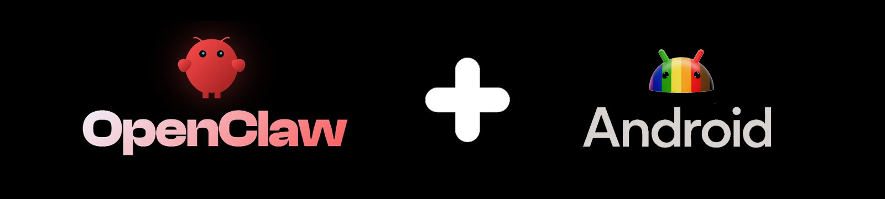

# OpenClaw en Android 🦞

[](https://developer.android.com)
[](https://f-droid.org/packages/com.termux/)
[]()
[](https://github.com/termux/proot-distro)
[](https://github.com/AidanPark/openclaw-android/blob/main/LICENSE)
[](https://github.com/AidanPark/openclaw-android)
[](https://github.com/AidanPark/openclaw-android/releases)
[](https://github.com/AidanPark/openclaw-android/issues)

[English](README.in.md) | [한국어](README.ko.md) | [中文](README.zh.md)

<div align="center">
  
  <br><br>
  <a href="#quick-start"></a>
  <a href="https://github.com/AidanPark/openclaw-android/releases"></a>
  <a href="https://github.com/AidanPark/openclaw-android/stargazers"></a>
</div>

> **Listo en 5 minutos** • **200MB de almacenamiento** • **Sin distro Linux necesaria**

Porque Android merece un shell.

---

## 📖 Tabla de Contenidos

- [🌟 Características](#-características)
- [🚀 Inicio Rápido](#-inicio-rápido)
- [📱 App Claw](#-app-claw)
- [📋 Configuración Paso a Paso](#-configuración-paso-a-paso)
- [⚙️ Referencia CLI](#️-referencia-cli)
- [🔄 Actualización y Respaldo](#-actualización-y-respaldo)
- [🛠️ Detalles Técnicos](#️-detalles-técnicos)
- [❓ Solución de Problemas](#-solución-de-problemas)
- [📊 Rendimiento](#-rendimiento)
- [🤖 LLM Local](#-llm-local-en-android)
- [📚 Licencia](#-licencia)

---

## 🌟 Características

|                                        |                                                                        |
| -------------------------------------- | ---------------------------------------------------------------------- |
| 🚀 **Configuración Relámpago**         | Un comando instala glibc + Node.js + OpenClaw. **3-10 min** en WiFi.   |
| 📱 **App Independiente**               | APK con dashboard WebView + terminal PTY. No Termux necesario.         |
| ⚡ **Velocidad Nativa**                | Solo glibc ld.so — **sin sobrecarga proot**. Mismo rendimiento que PC. |
| 🛠️ **Cadena de Herramientas Completa** | code-server, Playwright, CLIs IA. Actualizar con `oa --update`.        |

---

## Sin instalación de Linux requerida

El enfoque estándar requiere instalar proot-distro con Linux, añadiendo 700MB-1GB de sobrecarga. OpenClaw en Android instala solo el enlazador dinámico glibc (ld.so).

**Enfoque estándar** — proot-distro + Linux completo:

```
┌───────────────────────────────────────────────────┐
│ Linux Kernel                                      │
│  Android · Bionic libc · Termux                   │
│    proot-distro · Debian/Ubuntu                   │
│      GNU glibc                                    │
│      Node.js → OpenClaw                           │
└───────────────────────────────────────────────────┘
```

**Este proyecto** — solo el enlazador dinámico glibc:

```
┌───────────────────────────────────────────────────┐
│ Linux Kernel                                      │
│  Android · Bionic libc · Termux                   │
│    glibc ld.so (solo enlazador)                   │
│    ld.so → Node.js → OpenClaw                     │
└───────────────────────────────────────────────────┘
```

|                   | Estándar (proot-distro) | OpenClaw Android     |
| ----------------- | ----------------------- | -------------------- |
| 💾 Almacenamiento | 1-2GB                   | **~200MB**           |
| ⏱️ Configuración  | 20-30 min               | **3-10 min**         |
| ⚡ Rendimiento    | Más lento (capa proot)  | **Velocidad nativa** |
| 🔧 Pasos          | Multi-paso              | **Un comando**       |

---

- **🔒 App Sandbox**: Todo funciona dentro de la app, sin necesidad de apps externas ni acceso root
- **Dashboard Nativo**: Interfaz React que actúa como centro de control (Bootstrap UI).
- **Instalación Híbrida Inteligente**:
  - _Payload (Offline)_: OpenClaw embebido en APK. Sin internet, instantáneo.
  - _Termux Bootstrap (Online)_: Descarga curl/bash/apt para scripts online.
  - _Proot (Opcional)_: Ubuntu mini aislado, resistente a Phantom Process Killer.
- **Zero Overhead**: Ejecución directa vía glibc ld.so, sin capas de emulación.

Descarga el APK desde [Releases](https://github.com/AidanPark/openclaw-android/releases).

---

## 🚀 Inicio Rápido

### Opción 1: Instalación vía APK (Recomendado)

La forma más sencilla — descarga el APK e instálalo directamente. Todo está contenido en la app.

1. Descargar APK desde [Releases](https://github.com/AidanPark/openclaw-android/releases)
2. Instalar el APK (permitir "Instalar apps desconocidas" si es necesario)
3. Abrir la app → Seleccionar modo de instalación:
   - **Payload**: OpenClaw offline embebido (~30 seg, sin internet)
   - **Termux Bootstrap**: Para scripts online con curl/bash (~3 min, requiere internet)
   - **Proot**: Ubuntu mini aislado (~5 min, resistente a Phantom Killer)
4. ¡Listo! El dashboard se abre automáticamente.

### Opción 2: Instalación vía Termux (Usuarios Avanzados)

Si prefieres usar la app de Termux externa:

> **Nota**: La versión de Play Store está descontinuada. Instalar desde [F-Droid](https://f-droid.org/packages/com.termux/).

```bash
pkg update -y && pkg install -y curl
curl -sL myopenclawhub.com/install | bash
openclaw onboard
```

Abrir dashboard: [myopenclawhub.com](https://myopenclawhub.com)

---

## 📋 Configuración Paso a Paso

### Requisitos

- Android 7.0 o superior (Android 10+ recomendado)
- ~200MB-500MB de almacenamiento libre (dependiendo del modo)
- Conexión Wi-Fi o datos móviles (solo para modos online)

### Arquitectura de 2 Sistemas

La app implementa **2 sistemas principales mutuamente excluyentes**:

```
┌─────────────────────────────────────────────────────────────┐
│                    SISTEMA TERMUX                           │
│              (Por defecto - Recomendado)                    │
│                                                             │
│  ┌──────────────────┐    ┌──────────────────┐                │
│  │   Payload        │    │   Bootstrap      │                │
│  │   (Offline)      │    │   (Online)       │                │
│  │                  │    │                  │                │
│  │  OpenClaw        │    │  curl, bash, apt │                │
│  │  embebido        │    │  descargados     │                │
│  │  ~30 seg         │    │  ~3 min          │                │
│  └──────────────────┘    └──────────────────┘                │
│                                                             │
└─────────────────────────────────────────────────────────────┘

┌─────────────────────────────────────────────────────────────┐
│                    SISTEMA PROOT                            │
│              (Alternativa - Avanzado)                       │
│                                                             │
│  • Ubuntu mini completo                                     │
│  • Resistente a Phantom Process Killer                      │
│  • ~5 min instalación, ~80MB                                │
│                                                             │
└─────────────────────────────────────────────────────────────┘
```

### Paso 1: Preparar tu Teléfono

Activar **Opciones de desarrollador** → **Mantener despierto** + deshabilitar optimización de batería.

Ver la [guía Mantener Procesos Vivos](docs/disable-phantom-process-killer.md) para instrucciones detalladas.

### Paso 2: Instalar APK

1. Descargar APK desde [Releases](https://github.com/AidanPark/openclaw-android/releases)
2. Instalar (permitir "Apps desconocidas" si es necesario)
3. Abrir la app

### Paso 3: Seleccionar Modo de Instalación

La app detectará automáticamente si hay un sistema instalado y mostrará las opciones disponibles.

| Modo                 | Cuándo usar                  | Tiempo  | Requiere internet |
| -------------------- | ---------------------------- | ------- | ----------------- |
| **Payload**          | Uso offline, velocidad       | ~30 seg | ❌ No             |
| **Termux Bootstrap** | Scripts online, flexibilidad | ~3 min  | ✅ Sí             |
| **Proot**            | Resistencia Phantom Killer   | ~5 min  | ✅ Sí             |

> ⚠️ **Sistemas mutuamente excluyentes**: Solo puedes tener uno activo. Para cambiar, desinstala primero.

### Paso 4: Completar Instalación

La app manejará automáticamente:

- Extracción de archivos (Payload) o descarga (Bootstrap/Proot)
- Configuración de entorno
- Inicio del gateway OpenClaw
- Apertura del dashboard

### Después de Instalar

- El dashboard se abre automáticamente
- Usa `oa --help` en el terminal para ver comandos disponibles
- Para detener el gateway: `Ctrl+C` en la pestaña del gateway

---

## Mantener Procesos Vivos

Android puede matar procesos en segundo plano. Ver la [guía Mantener Procesos Vivos](docs/disable-phantom-process-killer.md).

## Acceder al Dashboard desde tu PC

> **Nota**: SSH solo está disponible cuando usas el sistema **Termux Bootstrap** (que incluye `ssh`). No aplica a Payload (offline) ni a Proot directamente desde la app.

Ver la [Guía de Configuración SSH Termux](docs/termux-ssh-guide.md) para acceso remoto cuando uses Termux Bootstrap.

## Gestionar Múltiples Dispositivos

Usa [Dashboard Connect](https://myopenclawhub.com) para gestionar múltiples dispositivos desde tu PC. Las configuraciones de conexión se guardan solo en localStorage del navegador — tus datos permanecen locales.

---

## ⚙️ Referencia CLI

```bash
oa --help
```

| Comando          | Descripción                                      |
| ---------------- | ------------------------------------------------ |
| `oa --status`    | 📊 Estado del entorno (detecta App vs Termux)    |
| `oa --update`    | 🔄 Actualizar plataforma y herramientas          |
| `oa --install`   | 🛠️ Añadir herramientas (tmux, code-server, etc.) |
| `oa --backup`    | 💾 Respaldo compatible con la App                |
| `oa --restore`   | ⬆️ Restaurar datos                               |
| `oa --uninstall` | 🗑️ Remover de forma limpia                       |

---

## 🔄 Actualización y Respaldo

### Actualización

```bash
oa --update && source ~/.bashrc
```

Actualiza de una vez: OpenClaw, code-server, OpenCode, CLIs IA y parches Android. Los componentes ya actualizados se saltan. Seguro ejecutar múltiples veces.

> Si `oa` no está disponible: `curl -sL myopenclawhub.com/update | bash && source ~/.bashrc`

### Respaldo

```bash
oa --backup
```

Los respaldos se almacenan en `~/.openclaw-android/backup/` con timestamp. Incluye configuración, estado, workspaces y agents. Ruta personalizada: `oa --backup ~/mis-respaldos/`.

### Restauración

```bash
oa --restore
```

Lista los respaldos disponibles y restaura el seleccionado a `~/.openclaw/`.

---

## ❓ Solución de Problemas

Ver la [Guía de Solución de Problemas](docs/troubleshooting.md) para soluciones detalladas.

---

## 📊 Rendimiento

Los comandos CLI pueden sentirse más lentos que en PC por la velocidad de almacenamiento del teléfono. Sin embargo, **una vez que el gateway está ejecutándose, no hay diferencia** — el proceso permanece en memoria y las respuestas IA se procesan en servidores externos.

---

## 🤖 LLM Local en Android

OpenClaw soporta inferencia LLM local vía [node-llama-cpp](https://github.com/withcatai/node-llama-cpp). El binario precompilado (`@node-llama-cpp/linux-arm64`) carga exitosamente bajo glibc — técnicamente funcional en el teléfono.

| Restricción    | Detalles                                                                 |
| -------------- | ------------------------------------------------------------------------ |
| RAM            | Modelos GGUF necesitan 2-4GB libres (7B, Q4). RAM compartida con Android |
| Almacenamiento | Modelos de 4GB a 70GB+. Espacio limitado                                 |
| Velocidad      | CPU-only en ARM es muy lento. Sin GPU offloading                         |
| Caso de uso    | Para producción, usar APIs LLM cloud (misma velocidad que PC)            |

Para experimentar: TinyLlama 1.1B (Q4, ~670MB) funciona en el teléfono.

> **¿Por qué `--ignore-scripts`?** El postinstall de node-llama-cpp intenta compilar llama.cpp desde fuente vía cmake — 30+ minutos en teléfono y falla por incompatibilidades de toolchain. Los binarios precompilados funcionan sin este paso.

---

## 🛠️ Detalles Técnicos

### Arquitectura de 2 Sistemas

La app implementa **2 sistemas principales** dentro del sandbox:

```
┌─────────────────────────────────────────────────────────────┐
│                    SISTEMA TERMUX                           │
│                                                             │
│  ┌──────────────────┐    ┌──────────────────┐                │
│  │   Payload        │    │   Bootstrap      │                │
│  │   (Offline)      │    │   (Online)       │                │
│  │                  │    │                  │                │
│  │  • OpenClaw      │    │  • curl          │                │
│  │  • Node.js       │    │  • bash          │                │
│  │  • glibc         │    │  • apt/pkg       │                │
│  │  Embebido en APK │    │  Descargados     │                │
│  └──────────────────┘    └──────────────────┘                │
│                                                             │
└─────────────────────────────────────────────────────────────┘

┌─────────────────────────────────────────────────────────────┐
│                    SISTEMA PROOT                            │
│                                                             │
│  • proot binario estático                                 │
│  • Ubuntu mini rootfs (~80MB)                              │
│  • Resistente a Phantom Process Killer                      │
│                                                             │
└─────────────────────────────────────────────────────────────┘
```

### Componentes por Sistema

**Sistema Termux — Payload (Offline)**

| Componente  | Rol                | Origen          |
| ----------- | ------------------ | --------------- |
| Node.js v22 | Runtime JavaScript | Embebido en APK |
| glibc ld.so | Enlazador dinámico | Embebido en APK |
| OpenClaw    | Plataforma IA      | Embebido en APK |
| certs       | Certificados CA    | Embebido en APK |

**Sistema Termux — Bootstrap (Online)**

| Componente | Rol                  | Origen     |
| ---------- | -------------------- | ---------- |
| curl       | Descarga scripts     | Descargado |
| bash       | Shell completo       | Descargado |
| apt/pkg    | Gestor paquetes      | Descargado |
| git        | Control de versiones | Descargado |

**Sistema Proot**

| Componente    | Rol              | Origen           |
| ------------- | ---------------- | ---------------- |
| proot         | Emulador chroot  | Descargado       |
| Ubuntu rootfs | Sistema completo | Descargado       |
| apt           | Gestor paquetes  | Dentro de rootfs |

### Componentes Principales del APK

| Clase                      | Responsabilidad                     |
| -------------------------- | ----------------------------------- |
| `InstallationOrchestrator` | Orquestador unificado de 2 sistemas |
| `TermuxBootstrapManager`   | Instalación Termux Bootstrap        |
| `ProotManager`             | Gestión sistema Proot               |
| `PayloadInstaller`         | Extracción payload embebido         |
| `GlibcRunner`              | Ejecutor ELF via ld.so              |
| `JsBridgeFacade`           | API segura WebView↔Kotlin           |
| `TerminalSessionManager`   | 3 modos: proot/online/payload       |

### Seguridad

- **Sandbox completo**: Todo en `context.getFilesDir()`
- **Sin permisos externos**: `MANAGE_EXTERNAL_STORAGE` eliminado
- **Comandos no expuestos**: `runCommand()` eliminado de bridges
- **Validación de sistemas**: Bloqueo de instalación mutua

### Estructura del Proyecto

```
openclaw-android/
├── bootstrap.sh                # Instalador one-liner curl | bash
├── install.sh                  # Instalador principal (punto de entrada)
├── oa.sh                       # CLI unificado ($PREFIX/bin/oa)
├── post-setup.sh               # Post-bootstrap App Claw (OTA)
├── update.sh                   # Wrapper → update-core.sh
├── update-core.sh              # Actualizador ligero
├── uninstall.sh                # Remoción limpia
├── patches/
│   ├── glibc-compat.js         # Parches runtime Node.js
│   ├── argon2-stub.js          # Stub argon2 (code-server)
│   ├── termux-compat.h         # Header C para builds Bionic
│   ├── spawn.h                 # Stub POSIX spawn
│   └── systemctl               # Stub systemd
├── scripts/
│   ├── lib.sh                  # Librería funciones compartidas
│   ├── check-env.sh            # Chequeo pre-vuelo
│   ├── install-infra-deps.sh   # Infraestructura L1
│   ├── install-glibc.sh        # glibc-runner (L2)
│   ├── install-nodejs.sh       # Node.js wrapper glibc (L2)
│   ├── install-build-tools.sh  # Herramientas build (L2)
│   ├── backup.sh               # Respaldo/restauración
│   ├── install-chromium.sh     # Chromium
│   ├── install-playwright.sh   # Playwright
│   ├── install-code-server.sh  # code-server
│   ├── install-opencode.sh     # OpenCode
│   ├── setup-env.sh            # Variables de entorno
│   └── setup-paths.sh          # Directorios y symlinks
├── platforms/
│   └── openclaw/
│       ├── config.env          # Metadatos y dependencias
│       ├── env.sh              # Variables de entorno
│       ├── install.sh          # Instalación plataforma
│       ├── update.sh           # Actualización plataforma
│       ├── uninstall.sh        # Remoción plataforma
│       ├── status.sh           # Estado plataforma
│       ├── verify.sh           # Verificación plataforma
│       └── patches/            # Parches específicos
├── tests/
│   └── verify-install.sh       # Verificación post-instalación
└── docs/
    ├── disable-phantom-process-killer.md
    ├── termux-ssh-guide.md
    ├── troubleshooting.md
    └── images/
```

### Arquitectura Plugin-Plataforma

```
Orquestadores (install.sh, update-core.sh, uninstall.sh)
  └── Agnóstica de plataforma. Lee config.env y delega.

Scripts Compartidos (scripts/)
  ├── L1: install-infra-deps.sh (siempre)
  ├── L2: install-glibc.sh, install-nodejs.sh,
  │       install-build-tools.sh (condicional config.env)
  └── L3: Herramientas opcionales (seleccionadas usuario)

Plugins Plataforma (platforms/<name>/)
  ├── config.env: declara dependencias (PLATFORM_NEEDS_*)
  └── install.sh / update.sh / uninstall.sh / ...
```

| Capa | Alcance                          | Ejemplos                    | Controlado por        |
| ---- | -------------------------------- | --------------------------- | --------------------- |
| L1   | Infraestructura (siempre)        | git, `pkg update`           | Orquestador           |
| L2   | Runtime plataforma (condicional) | glibc, Node.js, build tools | Banderas `config.env` |
| L3   | Herramientas opcionales          | tmux, code-server, CLIs IA  | Prompts usuario       |

### Flujo de Instalación — 8 Pasos

| Paso                          | Descripción                                                                                                                      |
| ----------------------------- | -------------------------------------------------------------------------------------------------------------------------------- |
| [1/8] Chequeo de Entorno      | Termux, arquitectura CPU, espacio disco (mín. 1000MB), Phantom Process Killer                                                    |
| [2/8] Selección de Plataforma | Carga `config.env`. Actualmente fijo a `openclaw`                                                                                |
| [3/8] Herramientas Opcionales | 11 prompts Y/n: tmux, ttyd, dufs, android-tools, Chromium, Playwright, code-server, OpenCode, Claude Code, Gemini CLI, Codex CLI |
| [4/8] Infraestructura L1      | `pkg update && pkg upgrade`, instala `git`, crea directorios base                                                                |
| [5/8] Dependencias Runtime L2 | glibc-runner, Node.js v22 LTS, herramientas build (condicional)                                                                  |
| [6/8] Instalación Plataforma  | `npm install -g openclaw@latest --ignore-scripts`, parches, clawdhub                                                             |
| [7/8] Herramientas Opcionales | Instala las herramientas seleccionadas en el paso 3                                                                              |
| [8/8] Verificación            | Chequeos FAIL/WARN: Node.js >= 22, npm, OA_GLIBC, glibc ld.so, node wrapper                                                      |

### Flujo de Actualización — `oa --update`

| Paso                   | Descripción                                       |
| ---------------------- | ------------------------------------------------- |
| [1/5] Pre-flight check | Valida Termux, curl, plataforma, arquitectura     |
| [2/5] Descarga         | Tarball GitHub → directorio temporal              |
| [3/5] Infraestructura  | Actualiza lib.sh, setup-env.sh, parches, CLI `oa` |
| [4/5] Plataforma       | `openclaw@latest`, parches, clawdhub, sharp       |
| [5/5] Herramientas     | Actualiza solo las herramientas ya instaladas     |

---

## 🎉 Únete a la Comunidad

[⭐ Danos una estrella](https://github.com/AidanPark/openclaw-android/stargazers) •
[🐛 Issues](https://github.com/AidanPark/openclaw-android/issues) •
[💬 Discusiones](https://github.com/AidanPark/openclaw-android/discussions)

---

## 📚 Licencia

MIT License. Ver [LICENSE](LICENSE) para detalles.
