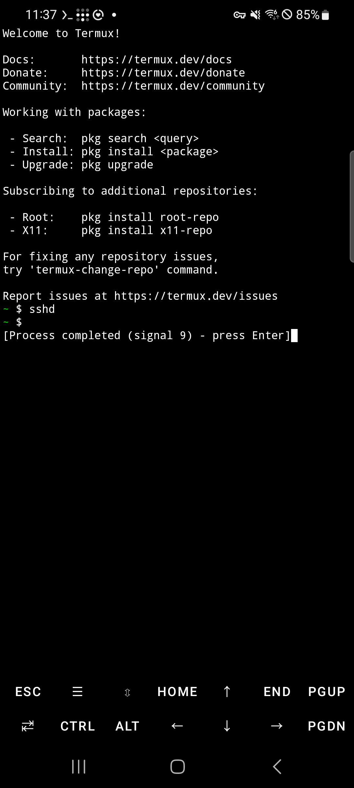
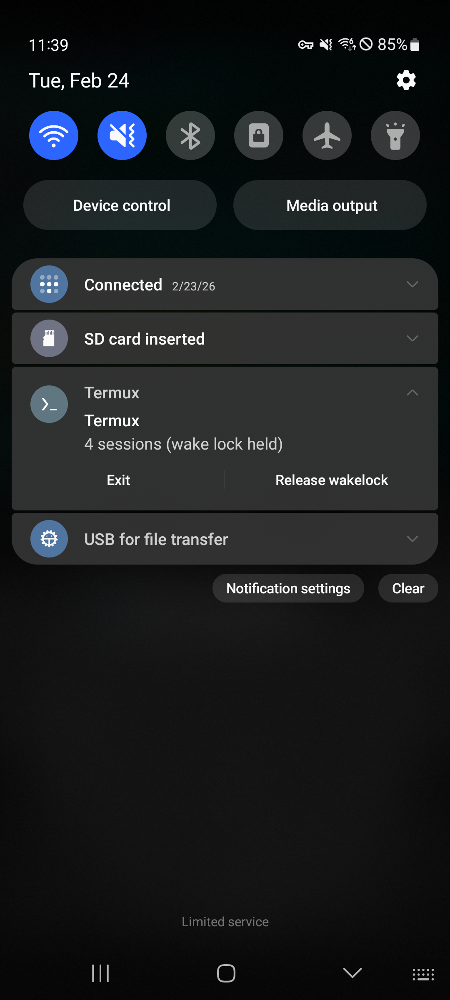
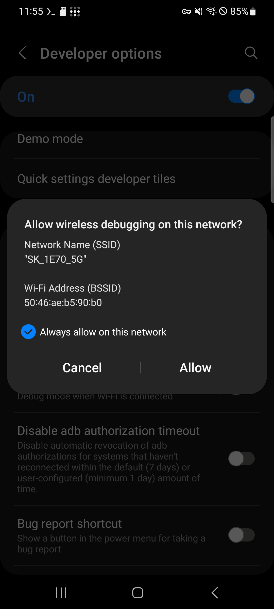
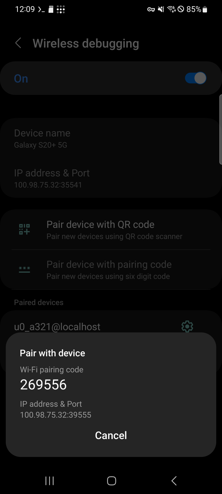
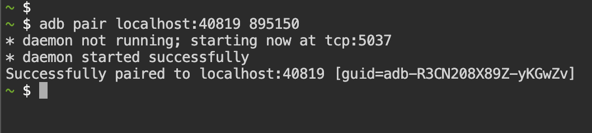
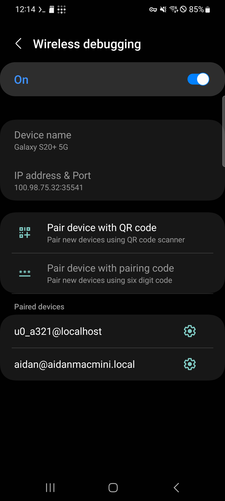
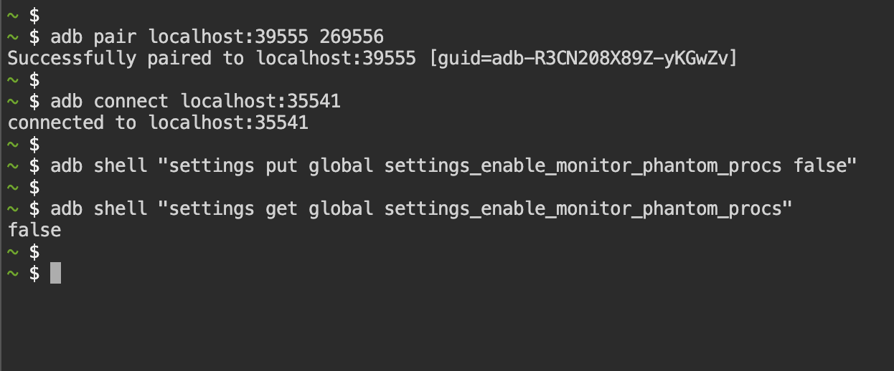

# Disable Phantom Process Killer (Android 12+)

Android 12 and above includes a feature called **Phantom Process Killer** that automatically terminates background processes. This can cause Termux processes like `openclaw gateway`, `sshd`, and `ttyd` to be killed without warning.

## Symptoms

If you see this message in Termux, Android has forcibly killed the process:

```
[Process completed (signal 9) - press Enter]
```



Signal 9 (SIGKILL) cannot be caught or blocked by any process — Android terminated it at the OS level.

## Requirements

- **Android 12 or higher** (Android 11 and below are not affected)
- **Termux** with `android-tools` installed (included in OpenClaw on Android)

## Step 1: Acquire Wake Lock

Pull down the notification bar and find the Termux notification. Tap **Acquire wakelock** to prevent Android from suspending Termux.

<p>
  
  
</p>

Once activated, the notification will show **"wake lock held"** and the button changes to **Release wakelock**.

> Wake lock alone is not enough to prevent Phantom Process Killer. Continue with the steps below.

## Step 2: Enable Wireless Debugging

1. Go to **Settings** > **Developer options**
2. Find and enable **Wireless debugging**
3. A confirmation dialog will appear — check **"Always allow on this network"** and tap **Allow**



## Step 3: Install ADB (if not already installed)

In Termux, install `android-tools`:

```bash
pkg install -y android-tools
```

> If you installed OpenClaw on Android, `android-tools` is already included.

## Step 4: Pair with ADB

1. In **Wireless debugging** settings, tap **Pair device with pairing code**
2. A dialog will show the **Wi-Fi pairing code** and **IP address & Port**



3. In Termux, run the pairing command using the port and code shown on screen:

```bash
adb pair localhost:<PAIRING_PORT> <PAIRING_CODE>
```

Example:

```bash
adb pair localhost:39555 269556
```



You should see `Successfully paired`.

## Step 5: Connect with ADB

After pairing, go back to the **Wireless debugging** main screen. Note the **IP address & Port** shown at the top — this is different from the pairing port.



In Termux, connect using the port shown on the main screen:

```bash
adb connect localhost:<CONNECTION_PORT>
```

Example:

```bash
adb connect localhost:35541
```

You should see `connected to localhost:35541`.

> The pairing port and connection port are different. Use the port shown on the Wireless debugging main screen for `adb connect`.

## Step 6: Disable Phantom Process Killer

Now run the following command to disable Phantom Process Killer:

```bash
adb shell "settings put global settings_enable_monitor_phantom_procs false"
```

Verify the setting:

```bash
adb shell "settings get global settings_enable_monitor_phantom_procs"
```

If the output is `false`, Phantom Process Killer has been successfully disabled.



## Notes

- This setting **persists across reboots** — you only need to do this once
- You do **not** need to keep Wireless debugging enabled after completing these steps. You can turn it off
- This does not affect normal app behavior — it only prevents Android from killing background processes in Termux
- If you factory reset your phone, you will need to repeat this process

## Further Reading

Some manufacturers (Samsung, Xiaomi, Huawei, etc.) apply additional aggressive battery optimization that can kill background apps. If you still experience process termination after disabling Phantom Process Killer, check [dontkillmyapp.com](https://dontkillmyapp.com) for device-specific guides.
